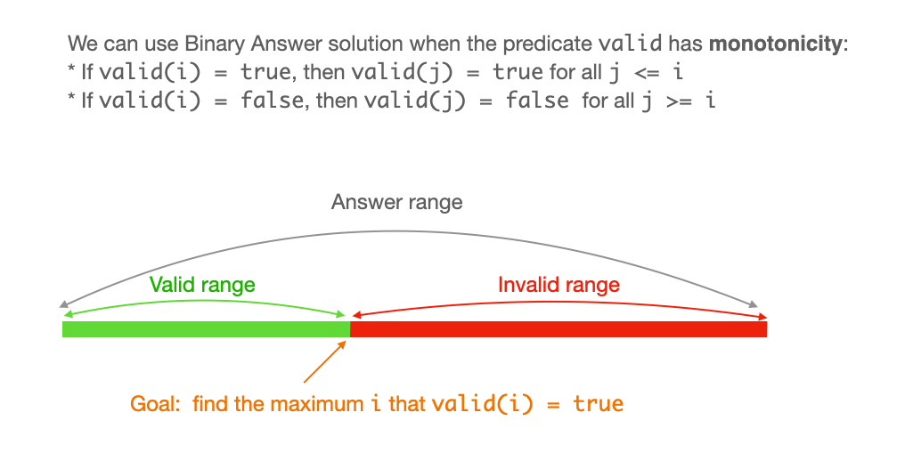

# Binary Answer

## What's Binary Answer
When the search range is small, the binary answer problems are solvable by linear scaning the answer range. For example, assume the answer range is `[0, 100]`, we can check `0`, then `1`, ..., then `100`, and we return the maximum number that is valid.

However, when the answer range is large, say `[0, 10^5]`, linear scanning the entire answer range will get TLE. 

So, instead of doing `O(N)` linear scanning, we binary search in the answer range which reduces the time complexity to `O(logN)`.

## When can we use Binary Answer?

We can use "Binary Answer" solution if we can write a predicate function `valid(i)` that has **monotocity**:

* If `valid(i) == true`, then `valid(j) == true` for all `j <= i`.
* If `valid(i) == false`, then `valid(j) == false` for all `j >= i`.



## Algorithm

Our goal is the find the maximum `i` that `valid(i) == true`.

We can use two pointers `L = minVal, R = maxVal`, and keep using binary search to move the pointers towards each other until they swap order. In the end, `R` will point to the largest value that is valid, `L` will point to the smallest value that is invalid.


## Pseudo Code

Assume the answer range is monotonically going from valid to invalid, and we are looking for the maximum valid value.

```cpp
int L = minVal, R = maxVal
while (L <= R) {
    int M = (L + R) / 2;
    if (valid(M)) L = M + 1;
    else R = M - 1;
}
return R >= minVal ? R : NOT_FOUND;
```

If we are looking for the minimal invalid value, simply return `L <= maxVal ? L : NOT_FOUND`.

## Problems

* [410. Split Array Largest Sum \(Hard\)](https://leetcode.com/problems/split-array-largest-sum/)
* [1482. Minimum Number of Days to Make m Bouquets \(Medium\)](https://leetcode.com/problems/minimum-number-of-days-to-make-m-bouquets/)
* [1300. Sum of Mutated Array Closest to Target \(Medium\)](https://leetcode.com/problems/sum-of-mutated-array-closest-to-target/)
* [1044. Longest Duplicate Substring \(Hard\)](https://leetcode.com/problems/longest-duplicate-substring/)
* [668. Kth Smallest Number in Multiplication Table (Hard)](https://leetcode.com/problems/kth-smallest-number-in-multiplication-table/)
* [719. Find K-th Smallest Pair Distance (Hard)](https://leetcode.com/problems/find-k-th-smallest-pair-distance/)
* [1283. Find the Smallest Divisor Given a Threshold (Medium)](https://leetcode.com/problems/find-the-smallest-divisor-given-a-threshold/)
* [1802. Maximum Value at a Given Index in a Bounded Array (Medium)](https://leetcode.com/problems/maximum-value-at-a-given-index-in-a-bounded-array/)
* [1870. Minimum Speed to Arrive on Time (Medium)](https://leetcode.com/problems/minimum-speed-to-arrive-on-time/)
* [1648. Sell Diminishing-Valued Colored Balls (Medium)](https://leetcode.com/problems/sell-diminishing-valued-colored-balls/)
* [1062. Longest Repeating Substring (Medium)](https://leetcode.com/problems/longest-repeating-substring/)
* [718. Maximum Length of Repeated Subarray (Medium)](https://leetcode.com/problems/maximum-length-of-repeated-subarray/)